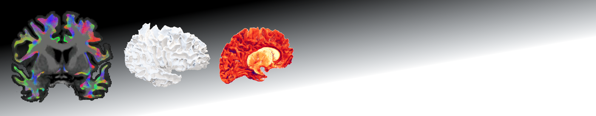

## Surface-based tracking for short association fibres

A processing framework designed to add flexibility for short association fibre tractogram filtering around the cortical surface. Targets streamlines that course through the white matter and terminate in the neocortex of the same hemisphere at either end. 

### Main features

- Options for filtering at the grey-white interface
- Indexing of the closest cortical mesh for each streamline termination enabling to relate streamline- and surface-based data
- Modularity (processing steps can be replaced) and support for optional post-processing modules
- Intuitive data structure to facilitate creation of custom scripts
- Summary statistics

### Documentation

Please see [`doc/README.txt`](https://github.com/dmitrishastin/SAF/blob/main/doc/README.md)

## Original paper

**Surface-based tracking for short association fibre tractography**.  
NeuroImage 2022, [doi: 10.1016/j.neuroimage.2022.119423](https://doi.org/10.1016/j.neuroimage.2022.119423)  
<a href="https://orcid.org/0000-0003-3937-3675">D. Shastin </a>, S. Genc, G.D. Parker, K. Koller, C.M.W. Tax, J. Evans, K. Hamandi, W.P. Gray, D.K. Jones, M. Chamberland.  

Please cite if using the framework.

## Software 

- **MATLAB**[^1] (2015a and above):  
    - framework execution
- **FreeSurfer**[^2]:
    - MATLAB scripts: read/write surface data
- **MRtrix3**[^3]:
    - MATLAB scripts: read/write streamline data
    - tractography [optional]: pre-generated unfiltered tractograms can be provided instead
    - tcksample [optional]: project per-streamline scalar image data on the surface
- **ANTs**[^4]: 
    - registration [optional]: if structural and diffusion data are not aligned 

[^1]: MATLAB: [website](https://uk.mathworks.com/products/matlab.html)
[^2]: FreeSurfer: [website](https://surfer.nmr.mgh.harvard.edu/) [citation](https://doi.org/10.1016/j.neuroimage.2012.01.021)
[^3]: MRtrix3: [website](https://www.mrtrix.org/) [citation](https://doi.org/10.1016/j.neuroimage.2019.116137)
[^4]: ANTs: [website](https://github.com/ANTsX/ANTs) [citation](https://scicomp.ethz.ch/public/manual/ants/2.x/ants2.pdf)
